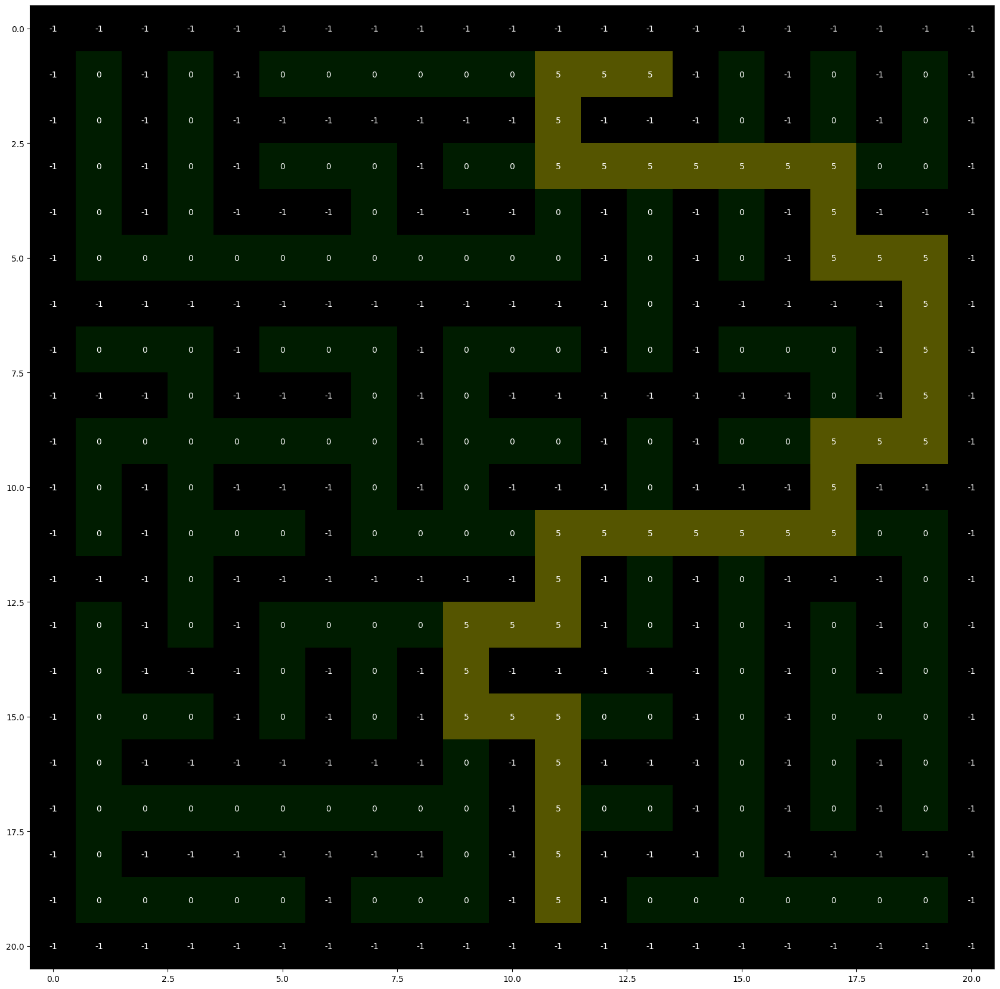

# A* algorithm in Python

A simple `A*` implementation using `matplotlib` to visualize the shortest path found from a point to another one.
This implementation was made during the discipline of complexities of algorithms during Computer Science at La Salle university.

## Implementation

The implementation uses `numpy` array to store the representation of the terrain.
The value `-1` represents an obstacle on the terrain.

## Running

Creating virtual environment and installing dependencies:

```shell
python -m venv .venv
source ./.venv/bin/activate

pip install -r requirements.txt
```

Generating a solution for a map:

```shell
python ./main.py --input "input-example"
```

### Example of solution




## Input layout

The implementation expects the input map file to have the following layout:

```text
<start_x> <start_y>
<end_x> <end_y>
<weight> <weight> <weight> <weight> <weight>
<weight> <weight> <weight> <weight> <weight>
<weight> <weight> <weight> <weight> <weight>
...
```

Example:

```text
2 3
8 8
0 0 -1 0 0 0 0 0
0 -1 0 0 -1 0 0 0
-1 0 0 -1 -1 0 0 0
...
```

## Running automated tests

The automated tests use [mazelib](https://github.com/john-science/mazelib) to create random mazes with **start** and **end** coordinates to validate the implementation by comparing the shortest path found with the solution found by other algorithms.

```shell
python -m unittest ./tests/astar_test.py
```